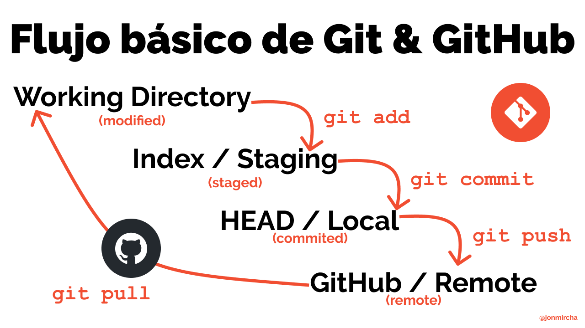

# Mis apuntes de P.L.L

## Comandos básicos de terminal

## Sintaxos de __*Markdown*__

## Comandos de *__git__*

### Configuración inicial

Estos comando los vas a ejecutar una sola vez, después de que hayas instaladp __*git*__ en tu computadora.


### Inicializando __*git*__

Cuando queremos inicializar __*git*__ en alguna carpeta local de nuestra computadora debemos ejecutar el comando:

> git init

Este comando lo debemos ejecutar solo una vez, para indicarle __*git*__ que comience a darle seguimiento al contenido de la carpeta.

El siguiente comando nos ayuda a visualizar 

> git status

### flujo basico  de __*Git y Git Hub*__



m
> git add (Nombre del archivo) 
# Encabezado de nivel 1

## Encabezado de nivel 2

### Encabezado de nivel 3

#### Encabezado de nivel 4

##### Encabezado de nivel 5

###### Encabezado de nivel 6

Esto es un parrafo en markdown se termina cuando damos enter

 Esto otro es parrafo

Para poner en negrita debes encerrar la palabra en **asteriscos**

Para poner en cursiva debes encerrar el texto entre _guiones bajos_

Para poner **_cursiva y negrita_** debes encerrar el texto entre guiones bajos

- Primavera
- Verano
- Otoño
- Invierno
---
1. Uno
2. Dos
1. Tres 
1. Cuatro
---
| _Pais_ | _Cuidad_ | _Continente_ |
|-|-|-|
| Mexico | Cdmx | America |
| Francia | Paris | Europa | 
| Japon | Tokio | Asia |

---

---
[hola](https://www.bing.com/images/search?q=hydreigon&form=HDRSC3&first=1)
---
[Aprende Markdown](https://jonmircha.com/markdown)
---

>hola

```js
function sumar(a, b) {
  if (typeof a !== "number" || typeof b !== "number") {
    console.error(`Los valores ingresados NO son números.`);
    return false;
  }

  let c = a + b;
  return c;
}
```

<form>
  <label for="q">Buscar:</label>
  <input type="search" name="q" id="q" required />
  <input type="submit" value="🔍" />
</form>

<!--haoiska-->

